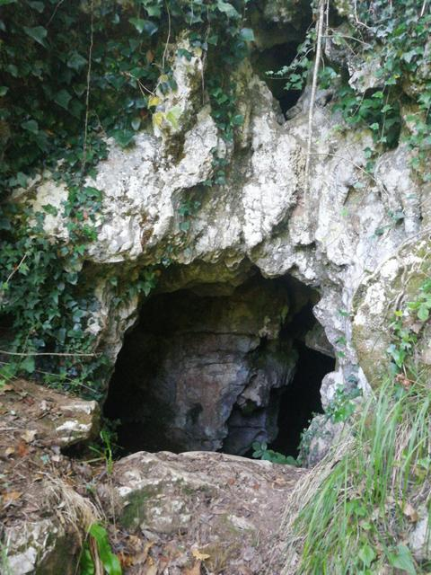

# XULS010_BucadellefatediCoreglia
## Sito: Buca delle fate di Coreglia
 

**Grotta con ingresso di piccole dimensione, con due camere e corridoio che porta a una calata di 10 m circa, localizzata sul versante sud-ovest della Costa dei gatti.**
